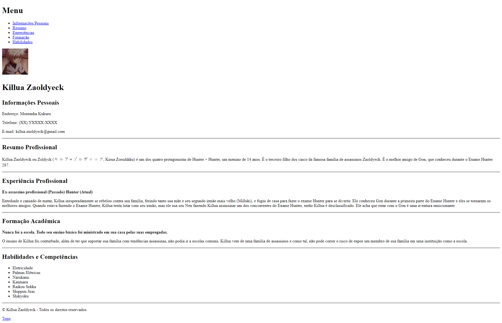
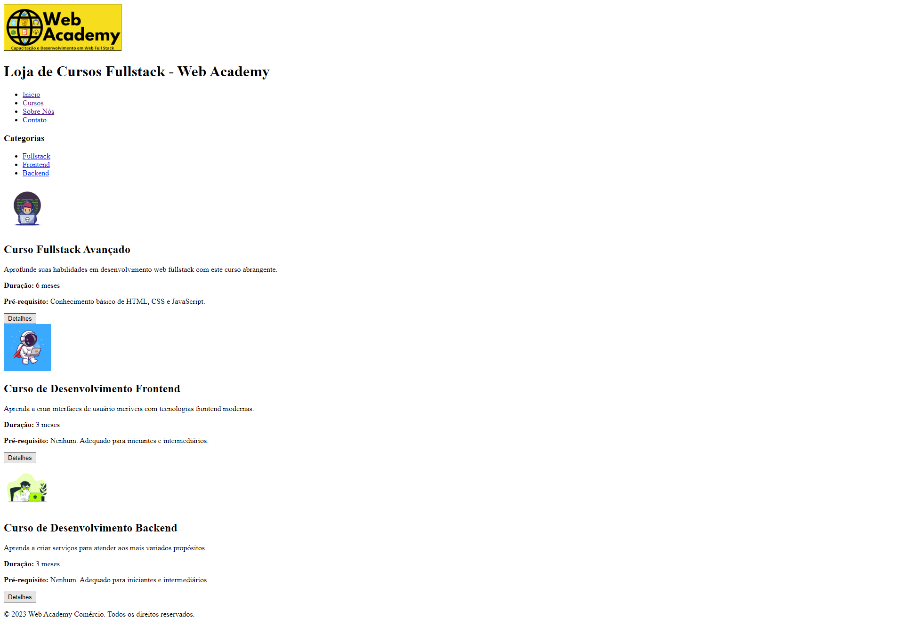
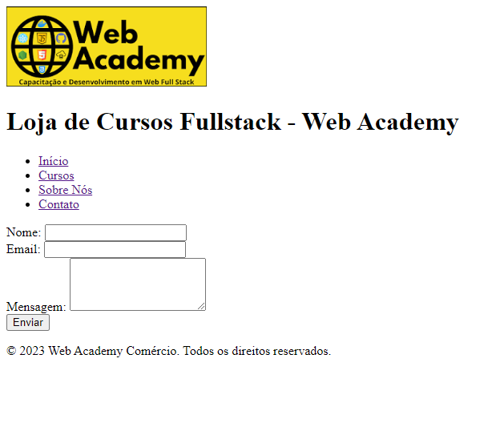
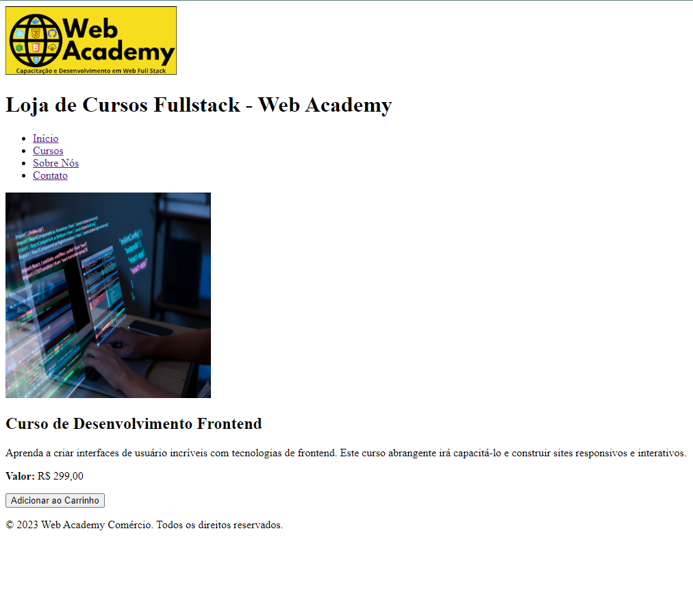

# Projeto Web Academy - ICOMP UFAM

 &nbsp;&nbsp;&nbsp;&nbsp;
 &nbsp;&nbsp;&nbsp;&nbsp;

## Disciplina: Introdução ao HTML5

🎓 **Aula 01: Desvendando a Magia do HTML** 📜
Na primeira aula, mergulhamos de cabeça nos conceitos essenciais para compreender a estrutura por trás das páginas web. Exploramos tópicos fascinantes, como:
- Sintaxe básica do HTML: A base de tudo!
- Semântica e Estruturação: Como dar significado ao seu conteúdo.
- Elementos de Texto: Tamanhos, hierarquia e parágrafos.
- Atributos: Dando vida aos elementos com valores e booleanos.
- Caracteres Especiais: Os segredos por trás dos símbolos.
- Hiperlinks e Âncoras: Navegando pelo ciberespaço com estilo.
- Listas: Ordenadas ou não, estruturando informações.
- Elementos de Quebra e Separação: Espaços e divisões.
- Tabelas: Organizando dados de forma tabular.

📚 **Aula 02: Desenhando a Web com Estilo** 🎨
Na segunda aula, aprofundamos nossa exploração, incorporando elementos de layout para dar vida a páginas web incríveis:
- Incorporação de Mídias: Adicionando áudio e vídeo para uma experiência imersiva.
- Iframes: Explorando conteúdo externo em nossa página.
- Formulários: Interatividade com campos de input, checkboxes e mais.
- Elementos de Bloco: Dividindo e conquistando com divs, navs, sections e mais.

## Imagens de Alguns Trabalhos Desenvolvidos Durante o Curso

### Exercício 01 - WebAcademy T3

### Exercício 02 - WebAcademy T3

### Exercício 03 - WebAcademy T3

### Exercício 04 - WebAcademy T3

## Exercícios feitos por mim na Turma 02 do WebAcademy

### Atividade 04 Desenvolvida no Trabalho 01 - WebAcademy T2

### Atividade 05 Desenvolvida no Trabalho 02 - WebAcademy T2

# Contato
- Email: ademar.castro.curriculo@gmail.com
- X (Twitter): https://twitter.com/AdemarCastro20
